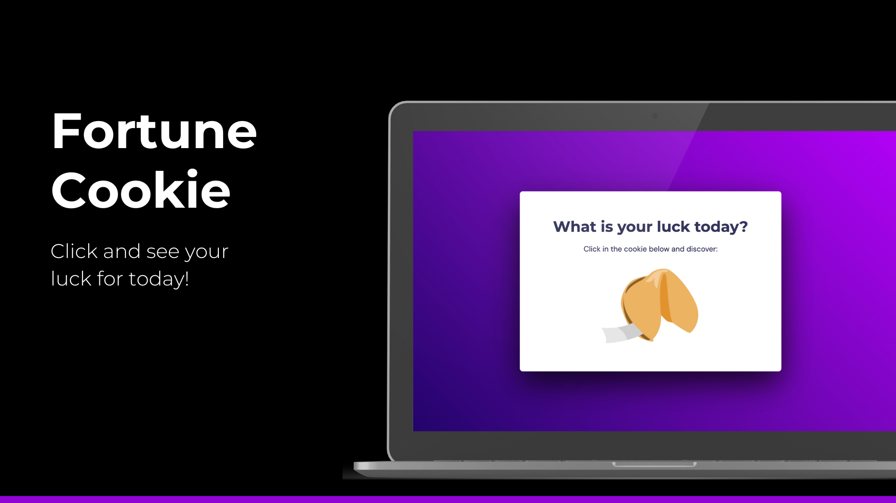

## The Project 
The fortune cookie is a animated Javascript feature that illustrates a motivational phrase to empower you to face your challenges!

Capturing the user interactions, the system randomizes ten positive phrases from different famous personalities, from Nelson Mandela to Beyoncé. Discover now!

## Technologies
The technologies used were:
- HTML;
- CSS;
- Javascript;
- Figma;

## Layout
You can see the project's layout at [link](https://www.figma.com/file/jiR3msf7va4gCvGn45p8zm/Biscoito-da-Sorte-(Community)?type=design&node-id=203-48&mode=design&t=jv7juRrrdPH9ufBV-0). 
A [Figma](https://www.figma.com) account is required.